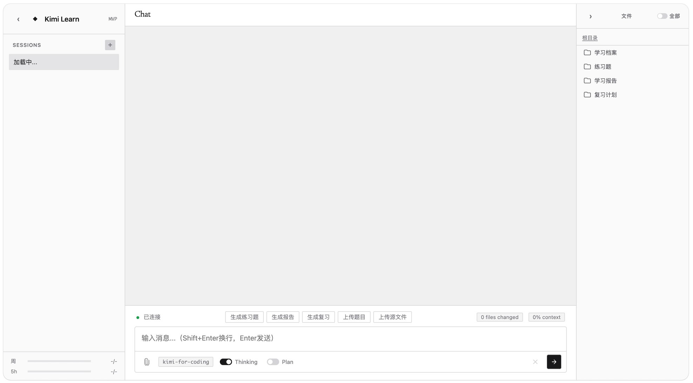

# Kimi Learn

Just simple skills that helps my brother & mother prepare for exams.

# Skills

- **generate-practice** : generate practices based on former exams.
- **generate-reports** : generate reports based on former learning history.
- **generate-review** : generate review report & practice.
- **upload-exam** : upload exam paper and save important questions, analysis and update user's custiomization.
- **upload-raw** : just turn things into markdown and save it.

# Customization

`custom/` would track users' identity. 

# `web`

To make the system easier to use for my family, also to practice my software agentic engineering skills, I built a MVP chat webpage based on [Kimi-CLI](https://github.com/MoonshotAI/kimi-cli)'s Wire feature.

# TODO:
- [ ] Add password system for visiting through ip.
- [ ] Add memory system. could refrence OpenClaw.
- [ ] Refine SKILLs.
- [x] Polish the webpage.
